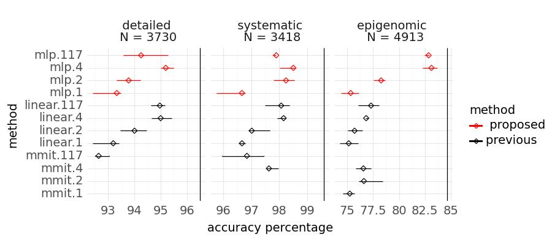
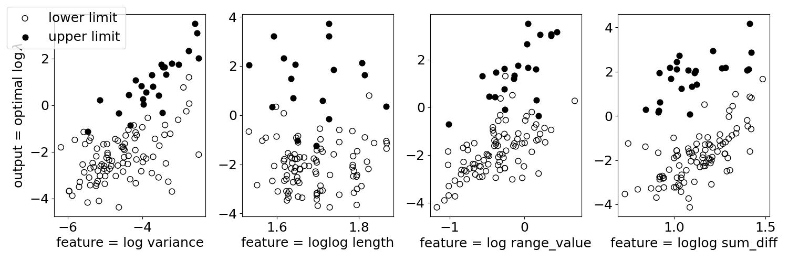
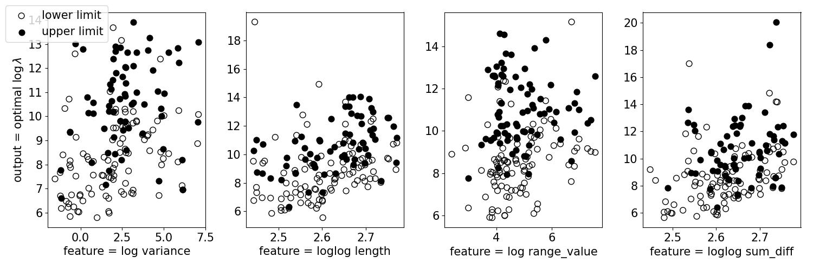
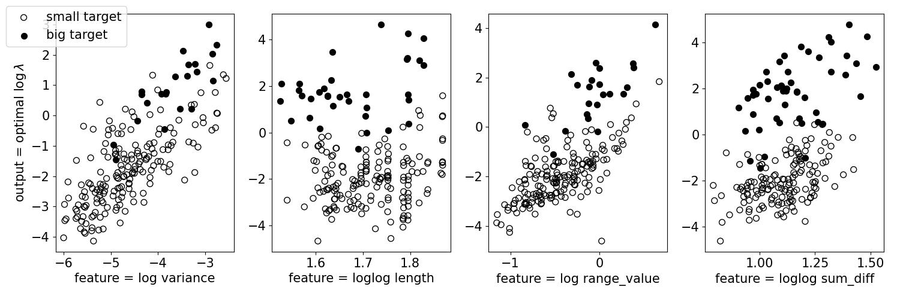
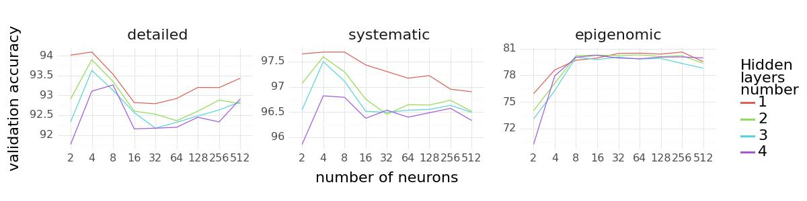

# Changepoint detection
## Problem
- What we have:
    - The number of sequence: 413
    - The number of data points per sequence: ranges from 39 to 43628 
    - The number of labels (regions) per sequence: ranges from 2 to 12
        - Negative regions $[a, b]$: neither of $a, a+1, \dots, b-1$ can be a changepoint.
        - Positive regions $[a, b]$: either $a, a+1, \dots, b-1$ can be a changepoint.
- What we have to find:
    - For each sequence $x = [x_1, x_2, \dots, x_N]$, find the set of changepoint $f \subset \{1, 2, \dots, N-1\}$ to minimize the number of incorect predicted labels.

## Algorithm
### Optimal Partitioning (OPART)
To implement the algorithm, we need to know the definition of this loss function:
$$L(x, t_1, t_2) = \min_{\mu} \sum_{i=t_1}^{t_2} (x_i - \mu)^2 = \sum_{i=t_1}^{t_2}(x_i - \frac{\sum_{j=t_1}^{t_2}x_i}{t_2-t_1+1})^2=\sum_{i=t_1}^{t_2}x_i^2-\frac{(\sum_{i=t_1}^{t_2}x_t)^2}{t_2-t_1+1}$$
Pseudo code (last changepoint algorithm):
- input:
    - sequence: $x = [x_1, x_2, \dots, x_N]$
    - penalty constant: $\lambda \geq 0$
- algorithm:
    - $C_0 = -\lambda$
    - for $t:1 \rightarrow N$:
        - $C_t = \min_{\tau \in \{0, 1, \dots, t-1\}} C_\tau + \lambda + L(x, \tau + 1, t)$
        - $\tau^*_t = \argmin_{\tau \in \{0, 1, \dots, t-1\}} C_\tau + \lambda + L(x, \tau + 1, t)$
    - getting last change point vector $\tau^* = [0, \tau^*_2, \tau^*_3, \dots, \tau^*_N]$
- output:
    - from vector $\tau^*$, traceback from $\tau^*_N$ to get the set of changepoint

### Labled Optimal Partitioning (LOPART)
Similar to OPART, there is only one difference: inside the for loop, instead of consider $\tau \in \{0, 1, \dots, t-1\}$, we consider $\tau \in T$ which satisfy the number of changepoints from all of the train labels.

## Penalty Value Learning
To choose the best value of $\lambda$ (apply for either OPART or LOPART), we use the train set to learn the best $\lambda$ then apply that $\lambda$ to the test set. The train set and the test set have the same 413 sequences but different labels for each sequence.

### Bayesian Information Criterion (BIC)
Set $\lambda = \log(N)$ where $N$ is the length of the sequence. For example, $N = 100$, then $\lambda \approx 4.6$.

### Constant
Try $\lambda = 10^k$ where $k \in \{-5, -4.5, \dots, 5\}$.
Then choose a value with minimal train label errors, then
predicts this constant $\lambda$ for each test data sequence.

### Linear
- From the train set, for each sequence, use OPART with 21 different $\lambda$ from the previous part, and for each $\lambda$, we get the total number of train error.
- Then each sequence $i$, we have $\lambda = 10^{l_i} \rightarrow 10^{h_i}$ which minimize the train error labels.
- consider $\log(\lambda_i) = \log(\log(N_i))*w + b = x_iw + b$
- Because we want $\log(\lambda_i)$ is between $l_i$ and $h_i$, so we use the hinge square loss (margin = 1) which is similar to mean square error (but instead of having one minimal point, hinge square function has a range of minimal points) for learning $w$ and $b$:
$$L(\lambda_i, l_i, h_i) = \big(ReLU(x_iw+b - h_i + 1) + ReLU(l_i - x_iw - b + 1)\big)^2$$

# Changepoint detection penalty learning

## Folders:
- **`acc_rate`:** Contains CSV files detailing the accuracy rates for each implemented method.
- **`figures`:** Holds figures generated.
- **`training_data`:** Consists of data for training pertaining to error counts for each lambda, sequence features, and target intervals.

## Python Files:
- **`utility_functions.py`:** Collection of utility functions.
- **`BIC.py`:** Implements the computation of log_lambda using the Bayesian Information Criterion (BIC) approach.
- **`MLP.py`:** Implements learning log_lambda from a set of sequence features using a Multi-Layer Perceptron (MLP) approach.
- **`main.py`:** Serves as the main entry point, responsible for generating accuracy rate files in the `acc_rate` folder.

## Generating Figures from Scratch:
- Accuracy Rate Comparison figure:
  - Run `main_MLP.py` to generate a CSV file containing accuracy rates for each method. Add new methods if necessary (running `main_BIC.py` and `main_L1reg.py`).
  - Execute `figure_acc_compare.ipynb`, `figure_feature_engineer_compare.ipynb`, `figure_mlp_compare.ipynb`, `figure_features_target.ipynb`. The resulting figure will be generated in the `figures` folder.
    
    
    
    
    
