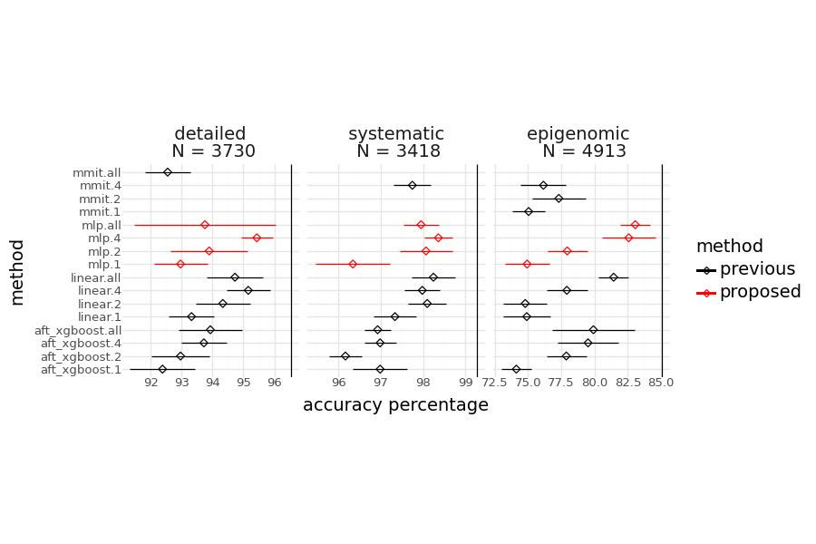

# Changepoint detection
## Publication
[Deep Learning Approach for Changepoint Detection: Penalty Parameter Optimization](https://arxiv.org/abs/2408.00856)
## Algorithm
### Optimal Partitioning (OPART)
To implement the algorithm, we need to know the definition of this loss function:
$$L(x, t_1, t_2) = \min_{\mu} \sum_{i=t_1}^{t_2} (x_i - \mu)^2 = \sum_{i=t_1}^{t_2}(x_i - \frac{\sum_{j=t_1}^{t_2}x_i}{t_2-t_1+1})^2=\sum_{i=t_1}^{t_2}x_i^2-\frac{(\sum_{i=t_1}^{t_2}x_t)^2}{t_2-t_1+1}$$
Pseudo code (last changepoint algorithm):
- input:
    - sequence: $x = [x_1, x_2, \dots, x_N]$
    - penalty constant: $\lambda \geq 0$
- algorithm:
    - $C_0 = -\lambda$
    - for $t:1 \rightarrow N$:
        - $C_t = \min_{\tau \in \{0, 1, \dots, t-1\}} C_\tau + \lambda + L(x, \tau + 1, t)$
        - $\tau^*_t = \argmin_{\tau \in \{0, 1, \dots, t-1\}} C_\tau + \lambda + L(x, \tau + 1, t)$
    - getting last change point vector $\tau^* = [0, \tau^*_2, \tau^*_3, \dots, \tau^*_N]$
- output:
    - from vector $\tau^*$, traceback from $\tau^*_N$ to get the set of changepoint

### Labled Optimal Partitioning (LOPART)
Similar to OPART, there is only one difference: inside the for loop, instead of consider $\tau \in \{0, 1, \dots, t-1\}$, we consider $\tau \in T$ which satisfy the number of changepoints from all of the train labels.

## Penalty Value Learning
To choose the best value of $\lambda$ (apply for either OPART or LOPART), we use the train set to learn the best $\lambda$ then apply that $\lambda$ to the test set.

### Bayesian Information Criterion (BIC)
Set $\lambda = \log(N)$ where $N$ is the length of the sequence. For example, $N = 100$, then $\lambda \approx 4.6$.

### Linear
- consider $\log(\lambda_i) = \log(\log(N_i))*w + b = x_iw + b$
- Because we want $\log(\lambda_i)$ is between $l_i$ and $h_i$, so we use the hinge square loss (margin = 1) which is similar to mean square error (but instead of having one minimal point, hinge square function has a range of minimal points) for learning $w$ and $b$:
$$L(\lambda_i, l_i, h_i) = \big(ReLU(x_iw+b - h_i + 1)\big)^2 + \big(ReLU(l_i - x_iw - b + 1)\big)^2$$

### MMIT
Similar to CART, MMIT using decision tree to predict the value of $\lambda$ using sequences features.

# Changepoint detection penalty learning

## Folders:
- **`0.data_process`:** code to process raw data from epigenomic dataset (do not include the dataset).
- **`0.lopart_code`:** code to process raw data from detailed and systematic dataset, and OPART/LOPART algorithm.
- **`1.linear`:** R code to run linear_unreg and linear_L1reg algorithms.
- **`1.MMIT`:** R code to run MMIT algorithm.
- **`acc_rate_csvs`:** Contains CSV files detailing the accuracy rates for each implemented method.
- **`figures`:** Holds figures generated and code to generate them.
- **`paper_figures`:** Holds other figures used for the paper.
- **`training_data`:** Consists of data for training pertaining to error counts for each lambda, sequence features, and target intervals.

## Python Files and Notebooks:
- **`BIC.ipynb`:** Implements the computation of log_lambda using the Bayesian Information Criterion (BIC) approach.
- **`get_table_chosen_mlp.ipynb`:** get table of chosen MLP configuration.
- **`get_acc_from_R_predictions.ipynb`:** update acc_rate_csvs from R predictions (linear or mmit).
- **`linear.ipynb`:** Implements learning log_lambda from a set of sequence features using linear approach.
- **`MLP.ipynb`, `MLP_117.ipynb`:** Implements learning log_lambda from a set of sequence features using a Multi-Layer Perceptron (MLP) approach.
- **`MLP_cv.ipynb`, `MLP_117_cv.ipynb`:** Cross validation to write a csv file about configuration and validation accuracy.
- **`MMIT.ipynb`:** get accuracy from predicted log lamda of MMIT.
- **`utility_functions.py`:** Collection of utility functions.

## Generating Figures from Scratch:
  - Run `BIC.ipynb`, `linear.ipynb`, `MLP.ipynb`, `MLP_117.ipynb`, `1.MMIT/MMIT.ipynb`, `1.linear/linear_L1reg/linear_l1reg.ipynb` for each dataset (set dataset to run in the beginning of notebook file), to generate a CSV file containing accuracy rates for each method.
  - Run `MMIT.ipynb` and `get_acc_from_R_predictions.ipynb` to update accuracies from linear_l1 and MMIT.
  - Execute `figures/0.get_plot_acc.ipynb`, `1.get_plot_mlp.ipynb`, `2.get_plot_features_targets.ipynb`, `figure_features_target.ipynb`. The resulting figure will be generated in the `figures` folder.
  
    
    
    
    
    
    

## Copyright

Unless otherwise stated, all content in this repository is licensed under the [Creative Commons Attribution 4.0 International License](https://creativecommons.org/licenses/by/4.0/). You are free to:

- Share — copy and redistribute the material in any medium or format
- Adapt — remix, transform, and build upon the material for any purpose, even commercially.

Under the following terms:
- Attribution — You must give appropriate credit, provide a link to the license, and indicate if changes were made. You may do so in any reasonable manner, but not in any way that suggests the licensor endorses you or your use.

For any questions regarding licensing or the use of this repository, please contact [Tung L Nguyen](mailto:nguyenlamtung10@gmail.com).
